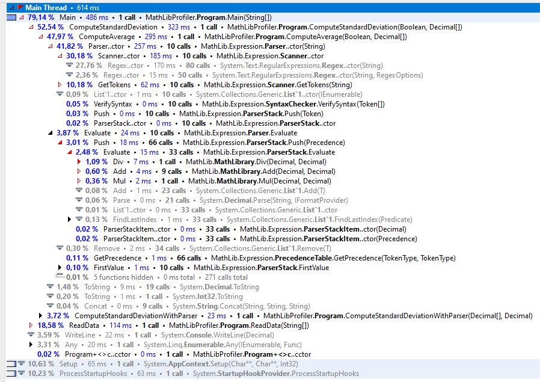
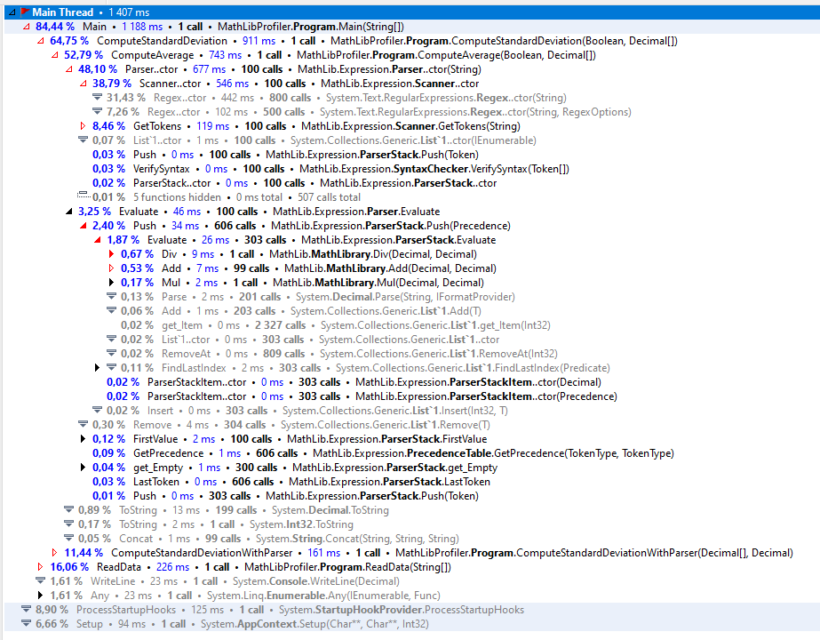
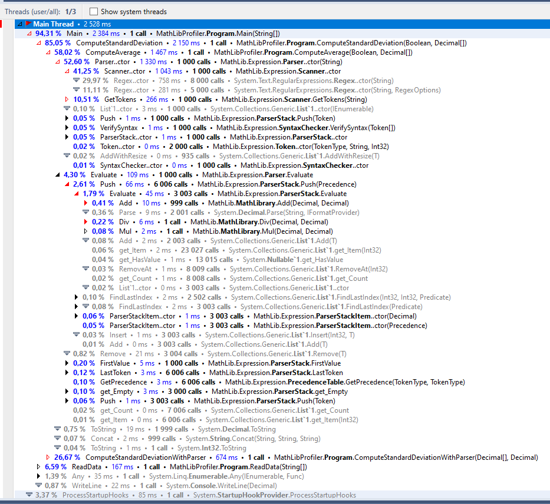

# Zpráva o profilaci matematické knihovny

## Použité nástroje
K profilaci byla vytvořena konzolová aplikace využívající matematickou knihovnu.
Tato konzolová aplikace poté byla spuštěna nástrojem JetBrain dotTrace.

## Výstup
Při profilingu matematické knihovny bylo zjištěno, že profilace nejvíc času stráví nad zpracováním matematických výrazů.
Mezi matematickými funkcemi byly nejčastěji volané metody pro sčítání, násobení a dělení.

### Možné optimalizace
- Zpracování výrazů pomocí regulárních výrazů.

## Výstupy z profilovací aplikace

### Profilace matematické knihovny o deseti hodnotách.

### Profilace matematické knihovny o sto hodnotách.

### Profilace matematické knihovny o tisíc hodnotách.

